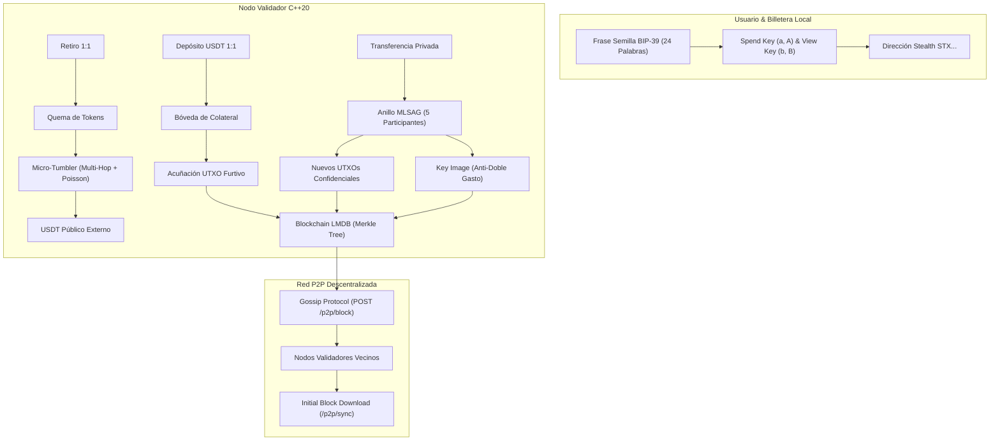

# CryptoPeg USDT — Monero-Grade Private Stablecoin

<div align="center">


**Stablecoin confidencial con respaldo 1:1 en USDT y privacidad criptográfica de grado Monero.**

[Características](#características) • [Arquitectura](#arquitectura-criptográfica) • [Inicio Rápido](#inicio-rápido) • [Billetera CLI](#billetera-cli-independiente) • [Red P2P](#red-descentralizada-p2p) • [API REST](#api-rest--json-rpc)

</div>

---

## Descripción General

**CryptoPeg USDT** es una implementación de grado institucional en **C++20 moderno** de una moneda estable vinculada 1:1 con Tether (USDT), que incorpora las tecnologías de anonimato financiero más avanzadas del ecosistema de Monero:

1. **Direcciones Furtivas (DKSAP - Dual-Key Stealth Address Protocol)**: Cada transacción se envía a una dirección efímera de un solo uso generada sobre curvas elípticas Ed25519. Ningún observador externo puede vincular pagos a la identidad pública del receptor.
2. **Firmas de Anillo MLSAG (RingCT)**: Ocultan el emisor mezclándolo dentro de un conjunto aleatorio de señuelos históricos de la cadena (*decoys*), logrando anonimato de remitente matemáticamente demostrable.
3. **Imágenes de Clave (*Key Images*)**: Prevención estricta de doble gasto sin revelar cuál salida del anillo fue la efectivamente gastada.
4. **Bóveda Colateralizada 1:1 con Pool de Comisiones**: Garantiza matemáticamente la solvencia estricta del sistema en micro-unidades financieras (6 decimales, estándar USDT TRC-20/ERC-20). Invariante: $\text{Colateral} \equiv \text{Circulante} + \text{Reserva Pool}$.
5. **Mezclador Asíncrono (*Micro-Tumbler*)**: Para redenciones externas a USDT público, fragmenta el retiro en múltiples tranches con saltos intermedios efímeros y retardos estocásticos de Poisson (*Time-Jitter*).
6. **Persistencia LMDB**: Motor de base de datos embebida con mapeo directo a memoria (`mmap`), sin necesidad de servidores externos como PostgreSQL o MySQL.
7. **Red Descentralizada P2P**: Protocolo de comunicación en malla con difusión Gossip de bloques, negociación mutua de pares (PEX) y descarga inicial rápida de cadena (Initial Block Download - IBD).
8. **Billetera CLI Independiente**: Cliente interactivo con derivación determinista de 24 palabras mnemónicas bajo estándar **BIP-39** y aislamiento total de claves privadas de gasto.
9. **Dashboard Web SPA**: Interfaz de usuario servida de forma nativa por el nodo para monitoreo en tiempo real, solvencia y explorador de bloques.

---

## Arquitectura Criptográfica



---

## Consumo y Eficiencia

Medido en producción dentro del contenedor Docker:
* **Memoria RAM:** ~**2.5 MB** en reposo.
* **CPU:** **< 1%** de un solo núcleo.
* **Tamaño de la Imagen:** **33.4 MB** comprimida.
* **Base de Datos:** Acceso en microsegundos vía memoria mapeada con LMDB.

---

## Inicio Rápido

### Requisitos Previos
* [Docker](https://docs.docker.com/get-docker/) y [Docker Compose](https://docs.docker.com/compose/install/) instalados.

### 1. Clonar el repositorio
```bash
git clone https://github.com/Adonisjose07/cryptopeg.git
cd cryptopeg
```

### 2. Configurar el entorno
Copia la plantilla de configuración:
```bash
cp .env.example .env
```

### 3. Levantar el nodo validador
```bash
docker compose up -d --build
```

El servidor estará escuchando en `http://localhost:8080`.
* **Dashboard Web SPA:** Abre tu navegador en [http://localhost:8080](http://localhost:8080).
* **Estado de Salud de la API:** `curl http://localhost:8080/api/v1/node/health`

---

## Billetera CLI Independiente

La billetera interactiva (`crypto_wallet_cli`) opera con aislamiento de claves privadas: la clave de gasto (`spend_private_key`) **nunca sale de tu máquina**, y el escaneo de fondos en la blockchain se efectúa mediante View-Key criptográfica.

### Lanzador rápido sin instalación
* **En Windows (CMD / PowerShell):**
  ```cmd
  .\wallet.bat
  ```
* **En Linux / macOS / WSL:**
  ```bash
  chmod +x wallet.sh
  ./wallet.sh
  ```

### Comandos de la Billetera

| Comando | Descripción |
| :--- | :--- |
| `create <nombre>` | Genera una nueva billetera y muestra la frase semilla BIP-39 de 24 palabras. |
| `restore <nombre>` | Recupera la billetera y todas sus claves a partir de las 24 palabras. |
| `open <archivo.wallet>` | Carga un archivo de billetera guardado previamente. |
| `save [archivo.wallet]` | Guarda la billetera activa en disco (por defecto `<nombre>.wallet`). |
| `address` | Muestra la dirección pública stealth Base58 (`STX...`) y claves de Spend y View. |
| `seed` | Muestra las 24 palabras mnemónicas de respaldo. |
| `balance` | Muestra el saldo confirmado en USDT y el desglose de UTXOs propios. |
| `sync` | Escanea la blockchain remotamente utilizando la View-Key privada. |
| `deposit <monto>` | Deposita colateral USDT y acuña tokens privados 1:1. |
| `transfer <dir_stealth> <monto>` | Envía fondos de forma anónima con firmas de anillo MLSAG y señuelos. |
| `withdraw <monto> <dir_publica>` | Canjea USDT 1:1 hacia una dirección pública externa mediante el micro-tumbler. |
| `claimfees <monto> <dir_0x>` | Reclama comisiones acumuladas del pool hacia la dirección de tesorería del protocolo. |
| `peers` | Consulta los nodos conectados en la red P2P, alturas y latencias. |
| `addpeer <url>` | Conecta manualmente este nodo a otro nodo validador P2P. |
| `status` | Consulta el estado general, altura de bloques y solvencia auditada del nodo. |
| `exit` / `quit` | Cierra la sesión de forma segura. |

---

## Red Descentralizada P2P

### Despliegue Local de 3 Nodos en Malla
Para probar una red distribuida de 3 validadores en tu propia computadora:

```bash
docker compose -f docker-compose.network.yml up -d
```
Esto levantará:
* **Nodo Semilla Alpha:** `http://localhost:8080`
* **Nodo Validador Beta:** `http://localhost:8081`
* **Nodo Validador Gamma:** `http://localhost:8082`

### Despliegue en Servidores Remotos / Producción
Para conectar nodos entre distintas computadoras o VPS en Internet:

1. **En tu Nodo Semilla (Servidor con IP pública o dominio):**
   ```env
   NODE_ID=nodo-semilla-oficial
   P2P_LISTEN_URL=http://seed.tudominio.com:8080
   # P2P_SEED_PEERS queda vacío
   ```
2. **En los Nodos Validadores de la comunidad:**
   ```env
   NODE_ID=validador-comunidad-1
   P2P_LISTEN_URL=http://ip-del-validador:8080
   P2P_SEED_PEERS=http://seed.tudominio.com:8080
   ```
   Al iniciar, los nodos nuevos ejecutarán el handshake, descargarán los bloques faltantes (*Initial Block Download*) y comenzarán a propagar transacciones por Gossip.

---

## API REST / JSON-RPC

El daemon expone los siguientes endpoints HTTP en el puerto `8080`:

| Método | Endpoint | Descripción |
| :--- | :--- | :--- |
| `GET` | `/api/v1/node/health` | Verificación de salud y versión del protocolo. |
| `GET` | `/api/v1/node/status` | Altura de la cadena, reservas del pool y auditoría de solvencia 1:1. |
| `GET` | `/api/v1/chain/blocks` | Lista de bloques históricos registrados en LMDB. |
| `GET` | `/api/v1/chain/block/:h` | Detalle completo de un bloque por altura. |
| `POST` | `/api/v1/wallet/generate` | Generación de identidad stealth (claves Ed25519). |
| `POST` | `/api/v1/wallet/scan` | Escaneo remoto de salidas mediante View-Key privada. |
| `POST` | `/api/v1/vault/deposit` | Depósito colateral y acuñación 1:1 a dirección furtiva. |
| `POST` | `/api/v1/tx/transfer` | Envío de transacción confidencial RingCT. |
| `POST` | `/api/v1/vault/withdraw` | Retiro y activación del micro-tumbler anonimizador. |
| `POST` | `/api/v1/vault/claim-fees` | Retiro de comisiones de tesorería del protocolo sin alterar colateral 1:1. |
| `GET` | `/api/v1/p2p/status` | Lista de pares activos, latencias e ID de nodo. |
| `GET` | `/api/v1/p2p/peers` | URLs de los pares conocidos para descubrimiento (PEX). |
| `POST` | `/api/v1/p2p/peers` | Registro manual de un nuevo par vecino. |
| `POST` | `/api/v1/p2p/handshake` | Negociación mutua de conexión P2P. |
| `POST` | `/api/v1/p2p/block` | Recepción y difusión Gossip de bloques. |
| `GET` | `/api/v1/p2p/sync` | Descarga de bloques históricos paginados (IBD). |

---

## Suite de Pruebas Automatizadas

El proyecto incluye 7 suites de pruebas unitarias y de integración end-to-end:

```bash
# Prueba de Red P2P (Handshake, Gossip en vivo y sincronización IBD)
docker run --rm --entrypoint /app/test_p2p_network crypto-core-node:latest

# Prueba de Billetera Mnemónica BIP-39 (Generación, derivación determinista y ciclo E2E)
docker run --rm --entrypoint /app/test_mnemonic_wallet crypto-core-node:latest

# Prueba de Auditoría y Precisión Financiera de la Bóveda 1:1
docker run --rm --entrypoint /app/test_vault_precision crypto-core-node:latest

# Prueba de Anonimato y Direcciones Furtivas DKSAP
docker run --rm --entrypoint /app/test_stealth_privacy crypto-core-node:latest

# Prueba de Persistencia Transaccional en LMDB
docker run --rm --entrypoint /app/test_lmdb_persistence crypto-core-node:latest

# Prueba del Mezclador Micro-Tumbler con Jitter de Poisson
docker run --rm --entrypoint /app/test_tumbler_mixer crypto-core-node:latest

# Prueba de la API REST / JSON-RPC
docker run --rm --entrypoint /app/test_rpc_api crypto-core-node:latest
```

---

## Smart Contracts de Custodia en Arbitrum L2 (Sepolia & One)

El directorio `contracts/` contiene la suite de contratos en **Solidity 0.8.24** para la custodia pública 1:1 de USDT:

* **`CryptoPegVault.sol`**: Custodia colateral descentralizada con protección contra ataques de repetición (*Replay Attacks*), autorización de retiros firmada por el validador del nodo y función de cobro de comisiones para la tesorería (`claimTreasuryFees`).
* **`MockUSDT.sol`**: Token ERC-20 idéntico al USDT oficial (6 decimales) con acuñación pública para pruebas gratuitas en la testnet **Arbitrum Sepolia**.

### ¿Por qué Arbitrum L2?
1. **Ultra-económico:** Costo promedio de transferencia ERC-20 de **\$0.001 a \$0.005 USD** por transacción.
2. **Liquidez y Mercado Masivo:** Arbitrum One es la L2 #1 en TVL (> \$3,000M) con emisión nativa de Tether.
3. **Compatibilidad EVM:** Cualquier dirección Ethereum estándar (`0x...`) funciona de manera transparente.
4. **Soporte de Exchanges:** Binance, OKX, Bybit, Coinbase y KuCoin admiten retiros y depósitos directos por Arbitrum One.

### Despliegue y Pruebas en Testnet (Arbitrum Sepolia)

```bash
cd contracts
npm install

# Ejecutar simulación completa local (Depósito -> Quema -> Retiro con Firma -> Cobro Tesorería)
npm test

# Desplegar en Arbitrum Sepolia (gratuito con faucet)
npm run deploy:sepolia
```

---

## Licencia

Distribuido bajo la Licencia **MIT**. Consulta el código fuente para más detalles.
