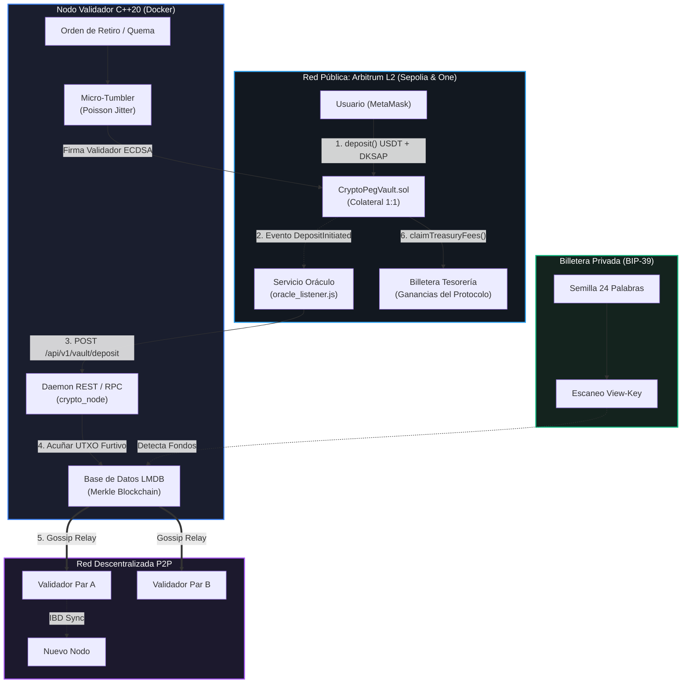

# CryptoPeg USDT — Monero-Grade Private Stablecoin & Arbitrum L2 Custody

<div align="center">


**Moneda estable confidencial vinculada 1:1 con USDT, privacidad criptográfica de grado Monero y custodia colateral en Arbitrum Layer 2.**

[Características](#características-principales) • [Arquitectura](#arquitectura-del-sistema) • [Roles de Nodo](#roles-del-nodo-validador-vs-oráculo) • [Inicio Rápido](#inicio-rápido-con-docker) • [Smart Contracts](#smart-contracts-en-arbitrum-sepolia) • [Billetera CLI](#billetera-cli-independiente) • [API REST](#api-rest--json-rpc)

</div>

---

## Características Principales

**CryptoPeg USDT** es un ecosistema financiero descentralizado de grado institucional implementado en **C++20 moderno** y **Solidity 0.8.24 (EVM Cancun)** que combina:

1. **Custodia Colateral 1:1 en Arbitrum L2 (`CryptoPegVault.sol`)**:
   * Desplegado en la red pública de bajo costo Arbitrum (gas promedio < \$0.005 USD).
   * Protección estricta contra ataques de repetición (*Anti-Replay Attack*).
   * Autorización criptográfica de retiros firmada por el validador del nodo mediante ECDSA.
   * Separación contable estricta de ganancias: función `claimTreasuryFees()` para la tesorería del protocolo que garantiza que el colateral de los usuarios permanezca 100% respaldado.
2. **Direcciones Furtivas (DKSAP - Dual-Key Stealth Address Protocol)**:
   * Cada transacción se envía a una dirección efímera de un solo uso sobre curvas Ed25519. Ningún observador externo puede vincular pagos a la identidad pública del destinatario.
3. **Firmas de Anillo MLSAG (RingCT)**:
   * Ocultan al emisor dentro de un conjunto aleatorio de señuelos históricos (*decoys*), logrando anonimato matemático demostrable.
4. **Imágenes de Clave (*Key Images*)**:
   * Prevención absoluta de doble gasto sin revelar cuál salida del anillo fue gastada.
5. **Mezclador Asíncrono (*Micro-Tumbler*) con Jitter de Poisson**:
   * Desembolso fraccionado en múltiples tranches con retardos temporales estocásticos de Poisson (*Time-Jitter anti-análisis de tráfico*).
6. **Persistencia Transaccional LMDB**:
   * Base de datos embebida con mapeo directo a memoria (`mmap`) y transacciones ACID en microsegundos.
7. **Red Descentralizada P2P en Malla**:
   * Protocolo de difusión Gossip de bloques, intercambio de pares (PEX) y descarga inicial acelerada (Initial Block Download - IBD).
8. **Billetera CLI BIP-39 (24 Palabras)**:
   * Cliente interactivo con aislamiento total de claves privadas de gasto (`spend_key`).
9. **Dashboard Web SPA Nativo**:
   * Servido directamente por el daemon para monitoreo de solvencia, explorador de bloques y gestión de tesorería.

---

## Arquitectura del Sistema



---

## Roles del Nodo: Validador vs Oráculo

El nodo soporta dos modos de operación configurables mediante la variable `ENABLE_ORACLE` en el archivo `.env`:

| Característica | Nodo Regular (`ENABLE_ORACLE=false`) | Nodo Oráculo (`ENABLE_ORACLE=true`) |
| :--- | :--- | :--- |
| **Público Objetivo** | 95% de los usuarios y validadores de la comunidad | Operadores de enlace y puentes oficiales |
| **Privacidad Externa** | **100% aislada** (No consulta RPCs públicos ni expone IP a Arbitrum) | Monitorea el Smart Contract en Arbitrum Sepolia |
| **Conexión de Red** | Únicamente red P2P Gossip en puerto `8080` | Red P2P Gossip + Arbitrum Sepolia RPC |
| **Consumo de Recursos** | Ultraligero (~2.5 MB RAM, < 1% CPU) | Ligero (~25 MB RAM con listener en segundo plano) |
| **Arranque Docker** | Inicia únicamente el motor `crypto_node` | **Inicia automáticamente** `crypto_node` y el oráculo en segundo plano |

---

## Smart Contracts en Arbitrum Sepolia

Los contratos inteligentes se encuentran desplegados, verificados y operando en la testnet pública **Arbitrum Sepolia**:

| Contrato | Dirección en Arbitrum Sepolia | Explorador Arbiscan |
| :--- | :--- | :--- |
| **MockUSDT** (Tether USD 6 decimales) | `0x900A96C51aac4EB8aF5FDa39bc0Ef13ADBe88B44` | [Ver en Arbiscan](https://sepolia.arbiscan.io/address/0x900A96C51aac4EB8aF5FDa39bc0Ef13ADBe88B44) |
| **CryptoPegVault** (Custodia Colateral 1:1) | `0x0ddFB2b3095DFC50E15bCD37b6A3a786a4DCB3e0` | [Ver en Arbiscan](https://sepolia.arbiscan.io/address/0x0ddFB2b3095DFC50E15bCD37b6A3a786a4DCB3e0) |

* **Dueño y Validador Autorizado:** `0x9d59867EfE155406f637F028997866f252dcc72c`
* **Comisión Depósito:** `0.50%` (50 bps)
* **Comisión Retiro:** `0.50%` (50 bps)
* **Invariante Matemática On-Chain:** $\text{Balance USDT Vault} \equiv \text{Circulante de Usuarios} + \text{Comisiones de Tesorería}$

---

## Inicio Rápido con Docker

### 1. Clonar el repositorio
```bash
git clone https://github.com/Adonisjose07/cryptopeg.git
cd cryptopeg
```

### 2. Configurar el entorno
Copia la plantilla preconfigurada con las direcciones oficiales en vivo:
```bash
cp .env.example .env
```

Si deseas que tu nodo opere como **Oráculo de Enlace** automático con Arbitrum, edita tu `.env`:
```env
ENABLE_ORACLE=true
```

### 3. Levantar el servicio
```bash
docker compose up -d --build
```
*Si `ENABLE_ORACLE=true`, el contenedor arrancará automáticamente el nodo validador C++ y el oráculo de Arbitrum en segundo plano mediante `entrypoint.sh` sin necesidad de comandos manuales.*

Accede al Dashboard Web en: **[http://localhost:8080](http://localhost:8080)**.

---

## Flujo de Depósito y Pruebas en Arbitrum Sepolia

### 1. Configuración de MetaMask
Para interactuar con el ecosistema de pruebas desde tu navegador:
1. **Red**: Arbitrum Sepolia
   - **RPC URL**: `https://sepolia-rollup.arbitrum.io/rpc`
   - **Chain ID**: `421614`
   - **Símbolo de Gas**: `ETH`
   - **Explorador**: [https://sepolia.arbiscan.io](https://sepolia.arbiscan.io)
2. **Importar Token MockUSDT**:
   - En MetaMask, haz clic en **Importar tokens** (al final de la lista de tokens).
   - Dirección del contrato del token: `0x900A96C51aac4EB8aF5FDa39bc0Ef13ADBe88B44`
   - Símbolo del token: `USDT`
   - Decimales del token: `6`

### 2. Flujo Automatizado de Depósito con Oráculo
Cuando un usuario transfiere colateral a la bóveda en Arbitrum:
1. El usuario aprueba (`approve`) USDT y ejecuta `deposit(amount, stealthViewPub, stealthSpendPub)` en el contrato `CryptoPegVault` (`0x0ddFB2b3095DFC50E15bCD37b6A3a786a4DCB3e0`).
2. El contrato transfiere el colateral a custodia, deduce la comisión del protocolo (0.50%) hacia la tesorería y emite el evento on-chain `DepositInitiated`.
3. El contenedor Docker con `ENABLE_ORACLE=true` detecta automáticamente el evento en segundos a través de `oracle_listener.js`.
4. El oráculo envía una solicitud interna al daemon local (`POST /api/v1/vault/deposit`).
5. El nodo C++ acuña la salida UTXO privada y protegida con DKSAP en la base de datos LMDB sin exponer la identidad del usuario.
6. El usuario sincroniza su billetera CLI (`sync` / `balance`) o monitorea el nuevo bloque en el Dashboard Web (`http://localhost:8080`).

---

## Variables de Entorno (`.env`)

| Variable | Descripción | Valor por Defecto |
| :--- | :--- | :--- |
| `NODE_ENV` | Entorno de ejecución (`production` o `development`). | `production` |
| `NODE_PORT` | Puerto HTTP del daemon y la red P2P. | `8080` |
| `ENABLE_ORACLE` | Activa el listener on-chain de Arbitrum L2 (`true` o `false`). | `false` |
| `ORACLE_POLL_INTERVAL_MS` | Frecuencia de sondeo de eventos en Arbitrum (milisegundos). | `5000` |
| `USDT_VAULT_ADDRESS` | Dirección del Smart Contract `CryptoPegVault` en Arbitrum. | `0x0ddFB2b3095DFC50E15bCD37b6A3a786a4DCB3e0` |
| `ARBITRUM_USDT_ADDRESS` | Dirección del token USDT oficial en Arbitrum. | `0x900A96C51aac4EB8aF5FDa39bc0Ef13ADBe88B44` |
| `ARBITRUM_SEPOLIA_RPC_URL` | Endpoint RPC para consultar la red Arbitrum Sepolia. | `https://sepolia-rollup.arbitrum.io/rpc` |
| `TREASURY_WALLET_ADDRESS` | Dirección `0x...` del administrador para recibir comisiones. | `0x9d59867EfE155406f637F028997866f252dcc72c` |
| `TESTNET_PRIVATE_KEY` | Clave privada para despliegue de contratos o interacción testnet. | *(Opcional / Vacío)* |
| `DEPOSIT_FEE_BPS` | Comisión de depósito al pool en puntos básicos (50 bps = 0.50%). | `50` |
| `WITHDRAW_FEE_BPS` | Comisión de retiro al pool en puntos básicos (50 bps = 0.50%). | `50` |
| `P2P_SEED_PEERS` | Lista de nodos semilla P2P para descubrimiento inicial (PEX). | `https://seednode.revoturs.net/` |

---

## Billetera CLI Independiente

La billetera interactiva (`crypto_wallet_cli`) opera con aislamiento de claves: la clave privada de gasto nunca sale de la máquina local.

### Lanzador rápido
* **Windows (CMD / PowerShell):** `.\wallet.bat`
* **Linux / macOS / WSL:** `./wallet.sh`

### Comandos de la Billetera

| Comando | Descripción |
| :--- | :--- |
| `create <nombre>` | Genera una nueva billetera y muestra la frase mnemónica BIP-39 de 24 palabras. |
| `restore <nombre>` | Restaura la billetera a partir de las 24 palabras de respaldo. |
| `open <archivo>` | Carga un archivo de billetera guardado previamente. |
| `save [archivo]` | Guarda la billetera activa en disco. |
| `address` | Muestra la dirección pública stealth Base58 (`STX...`) y las claves Spend/View. |
| `seed` | Muestra las 24 palabras mnemónicas de respaldo. |
| `balance` | Muestra el saldo confirmado en USDT y el listado de UTXOs propios. |
| `sync` | Escanea la blockchain remotamente utilizando la View-Key privada. |
| `deposit <monto>` | Deposita colateral USDT y acuña tokens privados 1:1. |
| `transfer <dir_stealth> <monto>` | Transfiere fondos de forma anónima con anillo MLSAG RingCT y señuelos. |
| `withdraw <monto> <dir_0x>` | Canjea USDT 1:1 hacia una dirección pública externa vía micro-tumbler. |
| `claimfees <monto> <dir_0x>` | Reclama comisiones acumuladas hacia la tesorería del protocolo. |
| `peers` | Lista pares conectados en la red P2P, alturas y latencias. |
| `addpeer <url>` | Conecta manualmente a otro nodo validador P2P. |
| `status` | Consulta el estado general, altura de bloques y solvencia auditada del nodo. |
| `exit` / `quit` | Cierra la sesión de forma segura. |

## Red Descentralizada P2P

### Despliegue Local de 3 Nodos en Malla
Para probar una red distribuida de 3 validadores en tu propia computadora:

```bash
docker compose -f docker-compose.network.yml up -d
```
Esto levantará:
* **Nodo Semilla Alpha:** `http://localhost:8080`
* **Nodo Validador Beta:** `http://localhost:8081`
* **Nodo Validador Gamma:** `http://localhost:8082`

### Conexión entre Servidores Remotos / Producción
Para conectar nodos entre distintas computadoras o VPS en Internet:

1. **En el Nodo Semilla (Servidor con IP pública o dominio):**
   ```env
   NODE_ID=nodo-semilla-oficial
   P2P_LISTEN_URL=http://seed.tudominio.com:8080
   # P2P_SEED_PEERS se deja vacío
   ```
2. **En los Nodos Validadores de la comunidad:**
   ```env
   NODE_ID=validador-comunidad-1
   P2P_LISTEN_URL=http://ip-del-validador:8080
   P2P_SEED_PEERS=http://seed.tudominio.com:8080
   ```
   Al iniciar, los nodos nuevos ejecutarán el handshake mutuo, descargarán los bloques faltantes (*Initial Block Download - IBD*) y comenzarán a propagar transacciones por Gossip en tiempo real.

---

## API REST / JSON-RPC

El daemon expone los siguientes endpoints HTTP en el puerto `8080`:

| Método | Endpoint | Descripción |
| :--- | :--- | :--- |
| `GET` | `/api/v1/node/health` | Estado de salud y versión del protocolo. |
| `GET` | `/api/v1/node/status` | Altura de la cadena, reservas del pool y solvencia matemática 1:1. |
| `GET` | `/api/v1/chain/blocks` | Historial de bloques registrados en LMDB. |
| `GET` | `/api/v1/chain/block/:h` | Detalle completo de un bloque por altura. |
| `POST` | `/api/v1/wallet/generate` | Generación de identidad stealth (claves Ed25519). |
| `POST` | `/api/v1/wallet/scan` | Escaneo remoto de salidas mediante View-Key privada. |
| `POST` | `/api/v1/vault/deposit` | Depósito colateral y acuñación 1:1 (admite `tx_hash` de Arbitrum y claves DKSAP). |
| `POST` | `/api/v1/tx/transfer` | Envío de transacción confidencial RingCT MLSAG. |
| `POST` | `/api/v1/vault/withdraw` | Retiro y activación del micro-tumbler anonimizador. |
| `POST` | `/api/v1/vault/claim-fees` | Retiro administrativo de comisiones hacia la tesorería. |
| `GET` | `/api/v1/p2p/status` | Pares activos, latencias e ID de nodo. |
| `GET` | `/api/v1/p2p/peers` | Lista de pares conocidos para descubrimiento (PEX). |
| `POST` | `/api/v1/p2p/peers` | Registro manual de un nuevo par vecino. |
| `POST` | `/api/v1/p2p/handshake` | Negociación mutua de conexión P2P. |
| `POST` | `/api/v1/p2p/block` | Recepción y difusión Gossip de bloques. |
| `GET` | `/api/v1/p2p/sync` | Descarga de bloques históricos paginados (IBD). |

---

## Suite de Pruebas Automatizadas

El proyecto incluye 7 suites de pruebas unitarias y de estrés (10,000 transacciones con micro-decimales):

```bash
# Prueba de Red P2P (Handshake, Gossip en vivo y sincronización IBD)
docker run --rm --entrypoint /app/test_p2p_network crypto-core-node:latest

# Prueba de Billetera Mnemónica BIP-39 (Generación, derivación determinista y ciclo E2E)
docker run --rm --entrypoint /app/test_mnemonic_wallet crypto-core-node:latest

# Prueba de Auditoría y Precisión Financiera de la Bóveda 1:1 y Tesorería
docker run --rm --entrypoint /app/test_vault_precision crypto-core-node:latest

# Prueba de Anonimato y Direcciones Furtivas DKSAP
docker run --rm --entrypoint /app/test_stealth_privacy crypto-core-node:latest

# Prueba de Persistencia Transaccional en LMDB
docker run --rm --entrypoint /app/test_lmdb_persistence crypto-core-node:latest

# Prueba del Mezclador Micro-Tumbler con Jitter de Poisson
docker run --rm --entrypoint /app/test_tumbler_mixer crypto-core-node:latest

# Prueba de la API REST / JSON-RPC
docker run --rm --entrypoint /app/test_rpc_api crypto-core-node:latest
```

---

## Licencia

Distribuido bajo la Licencia **MIT**. Consulta el código fuente para más detalles.
