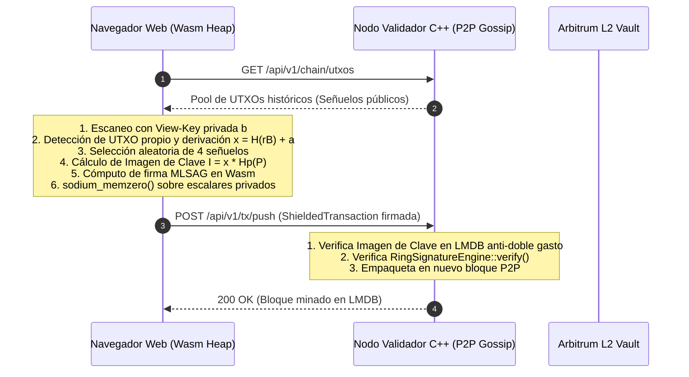

# Especificación Técnica: Arquitectura de Firma Client-Side en WebAssembly (Fase 3)

**Protocolo:** CryptoPeg USDT  
**Módulo:** Firma Criptográfica No-Custodial en Navegador / Cliente Wasm  
**Autoría:** Lead Cybersecurity & Cryptography Auditor & Senior Blockchain Architect  

---

## 1. Visión General y Propósito

Actualmente, las firmas de anillo RingCT MLSAG y la derivación de direcciones furtivas DKSAP se ejecutan en el daemon C++20 (`rpc_server.cpp`). En entornos locales o de nodo propio, esto preserva el control del operador. Sin embargo, para despliegues descentralizados y aplicaciones Web3 remotas, transmitir la `Spend Private Key` por la red HTTP representa un riesgo de custodia.

El objetivo de la **Fase 3** es compilar las primitivas criptográficas del protocolo a **WebAssembly (Wasm)** utilizando Emscripten (`em++`), permitiendo que:
1. Las claves privadas de gasto (`spend_private_key`), las semillas mnemónicas BIP-39 y los escalares efímeros ($r, \alpha$) **residan exclusivamente en la memoria volátil del navegador/cliente**.
2. El escaneo de salidas de un solo uso (View-Key Scanning) se ejecute en el cliente mediante Wasm.
3. La firma RingCT MLSAG ($I = x \cdot \mathcal{H}_p(P)$, compromisos de Pedersen y cierre del anillo con señuelos) se compute 100% en el dispositivo del usuario.
4. El daemon C++ actúe estrictamente como un nodo de difusión y consenso P2P, recibiendo objetos `ShieldedTransaction` pre-firmados.

---

## 2. Flujo de Transacción No-Custodial Client-Side



---

## 3. Pipeline de Compilación con Emscripten (`em++`)

### 3.1. Compilación de `libsodium` a WebAssembly
```bash
git clone https://github.com/jedisct1/libsodium.git --branch stable
cd libsodium
emconfigure ./configure --enable-minimal --disable-shared
emmake make
```

### 3.2. Enlace de Primitivas C++ con `emscripten/bind.h` (`bindings/wasm_bindings.cpp`)
```cpp
#include <emscripten/bind.h>
#include "stealth.hpp"
#include "ring_signature.hpp"

using namespace emscripten;
using namespace crypto;

EMSCRIPTEN_BINDINGS(cryptopeg_wasm) {
    register_vector<std::string>("StringVector");

    class_<StealthProtocol>("StealthProtocol")
        .class_function("createOneTimeOutput", optional_override([](std::string spendPubHex, std::string viewPubHex, uint64_t amount) {
            StealthAddress addr;
            auto s_bytes = from_hex(spendPubHex);
            auto v_bytes = from_hex(viewPubHex);
            std::memcpy(addr.spend_public_key.data(), s_bytes.data(), 32);
            std::memcpy(addr.view_public_key.data(), v_bytes.data(), 32);
            auto out = StealthProtocol::create_one_time_output(addr, amount);
            val res = val::object();
            res.set("ephemeral_pubkey", to_hex(out.ephemeral_public_key));
            res.set("destination_one_time", to_hex(out.destination_one_time));
            res.set("amount", out.amount);
            return res;
        }));

    class_<RingSignatureEngine>("RingSignatureEngine")
        .class_function("signTransaction", optional_override([](
            std::string txHashHex,
            val ringPubkeysArray,
            size_t realIndex,
            std::string realPrivkeyHex
        ) {
            Hash256 tx_hash;
            auto th_bytes = from_hex(txHashHex);
            std::memcpy(tx_hash.data(), th_bytes.data(), 32);

            std::vector<Key256> ring;
            size_t len = ringPubkeysArray["length"].as<size_t>();
            for (size_t i = 0; i < len; ++i) {
                auto pk_bytes = from_hex(ringPubkeysArray[i].as<std::string>());
                Key256 pk;
                std::memcpy(pk.data(), pk_bytes.data(), 32);
                ring.push_back(pk);
            }

            Key256 priv;
            auto priv_bytes = from_hex(realPrivkeyHex);
            std::memcpy(priv.data(), priv_bytes.data(), 32);

            auto sig = RingSignatureEngine::sign(tx_hash, ring, realIndex, priv);
            secure_wipe(priv);

            val sigObj = val::object();
            sigObj.set("key_image", to_hex(sig.key_image));
            sigObj.set("c0", to_hex(sig.c0));
            val responsesArr = val::array();
            for (size_t i = 0; i < sig.responses.size(); ++i) {
                responsesArr.set(i, to_hex(sig.responses[i]));
            }
            sigObj.set("responses", responsesArr);
            return sigObj;
        }));
}
```

### 3.3. Comando de Construcción
```bash
em++ -O3 -std=c++20 \
  -I./include \
  -I./libsodium/src/libsodium/include \
  src/stealth.cpp src/ring_signature.cpp src/pedersen.cpp bindings/wasm_bindings.cpp \
  ./libsodium/src/libsodium/.libs/libsodium.a \
  -s WASM=1 \
  -s MODULARIZE=1 \
  -s EXPORT_ES6=1 \
  -s EXPORT_NAME="CryptoPegWasmModule" \
  -s ALLOW_MEMORY_GROWTH=1 \
  -s NO_EXIT_RUNTIME=1 \
  --bind \
  -o public/wasm/cryptopeg_crypto.js
```

---

## 4. Salvaguardas de Seguridad en el Navegador

1. **Entropía CSPRNG:** Libsodium bajo WebAssembly utiliza nativamente `window.crypto.getRandomValues()` para el muestreo de escalares aleatorios ($r, \alpha$), garantizando seguridad indistinguible de entornos nativos.
2. **Higiene de Memoria (Zeroing):** La memoria Wasm reside en un búfer lineal `WebAssembly.Memory`. Toda función criptográfica que manipule secretos debe ejecutar `sodium_memzero` inmediatamente antes de retornar, evitando que residuos de claves privadas queden expuestos a scripts de telemetría o extensiones del navegador.
3. **Validación Canónica en el Nodo:** El nodo C++ receptor **nunca confía ciegamente** en el cliente; ejecuta `RingSignatureEngine::verify()`, valida la no-duplicidad de la Imagen de Clave en LMDB y comprueba la ecuación homomórfica de Pedersen antes de propagar la transacción por la red P2P.
